---

marp: true

theme: default

paginate: true

style: |

  h1 { color: #2c3e50; font-size: 2.2em; text-align: center; }

  h2 { color: #34495e; font-size: 1.5em; text-align: center; border-bottom: 2px solid #ecf0f1; padding-bottom: 10px; }

  p, li { font-size: 1.1em; color: #444; text-align: left; }

  .text-center { text-align: center; }

  .diagram { display: block; margin: 0 auto; max-width: 90%; max-height: 550px; border-radius: 8px; box-shadow: 0 4px 8px rgba(0,0,0,0.1); }

  .container { display: flex; flex-direction: column; align-items: center; justify-content: center; height: 100%; }

---

# AN ONLINE VOTING SYSTEM WITH ENHANCED SECURITY AND TRANSPARENCY

 

**ABE DAVID TEMILOREOFEJESU** (22/1929)

**ASIWAJU JAMES OLAWUNMI** (22/2263)

**OKOMADU OGHENETEJIRI OSCAR** (22/0703)

  

**Project Supervisor:** DR. AWODELE SIMON 

Babcock University, March 2026

---

## Introduction

- The **Online Voting System** modernizes the traditional voting process.

- Designed to solve challenges related to **transparency**, **security**, and **accessibility**.

- Replaces manual counting and physical ballots with a secure, digital platform.

- Focus on building trust and safeguarding the integrity of election outcomes.

---

## Core Objectives

- Enable remote, user-friendly voting for authorized users.

- Implement robust security measures to prevent tampering and duplicate votes.

- Ensure transparent real-time election monitoring and auditable logs.

- Reduce operational overhead compared to paper-based elections.

---

## Methodology & Requirements

- **Agile Development:** Iterative process ensuring the system aligns with stakeholder needs.

- **Secure Authentication:** Identity verification layer for all eligible voters.

- **Scalability:** Designed to handle high concurrent traffic during peak voting periods.

- **Cross-Platform:** Accessible across desktops and mobile devices without dedicated apps.

---

## Context Level Diagram

  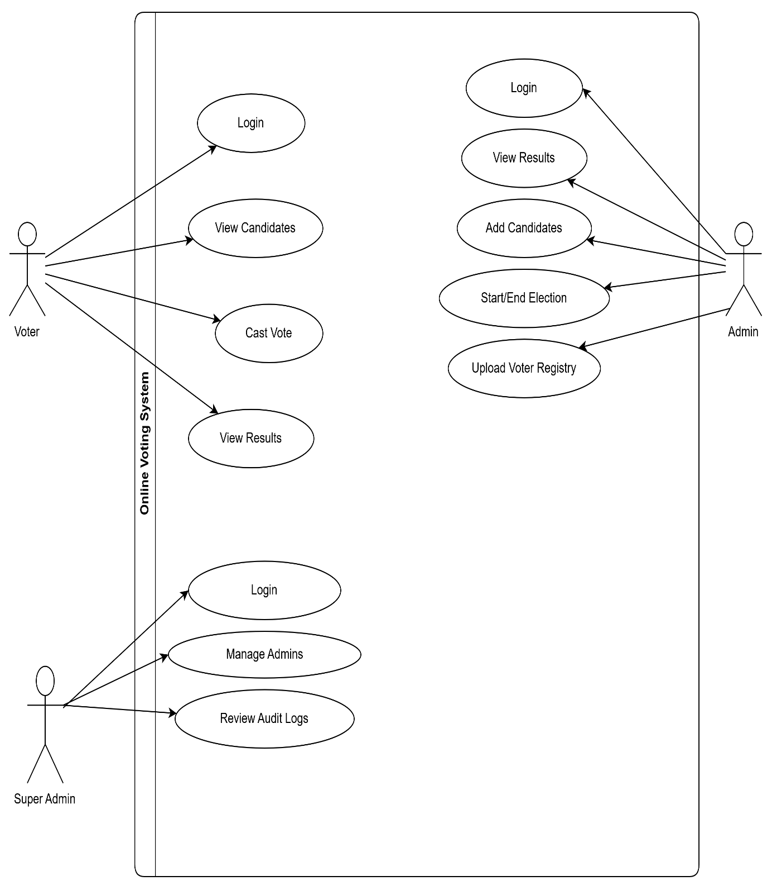

---

## Data Flow Diagram

  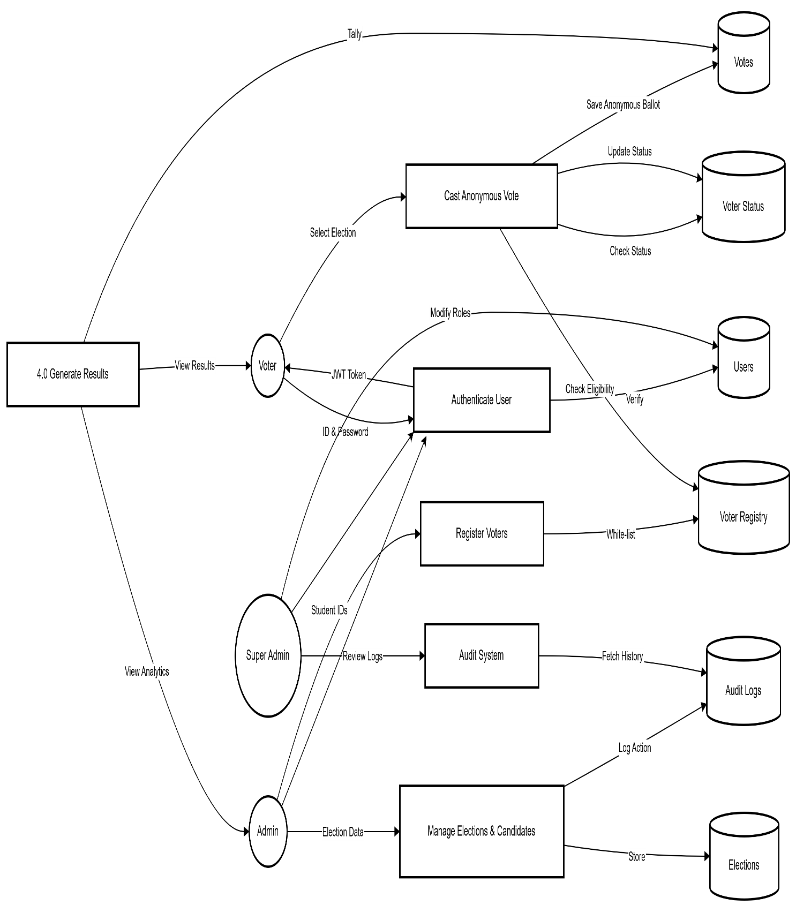

---

## Use Case Diagram

  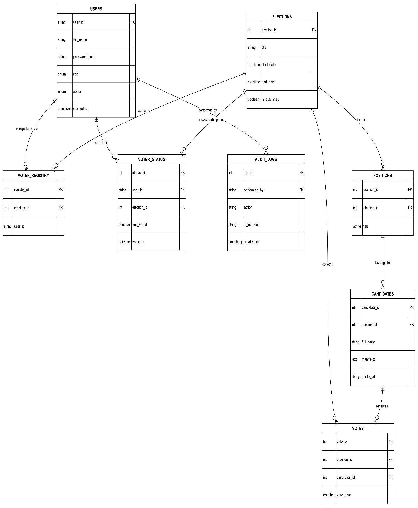

---

## Entity Relationship Diagram

  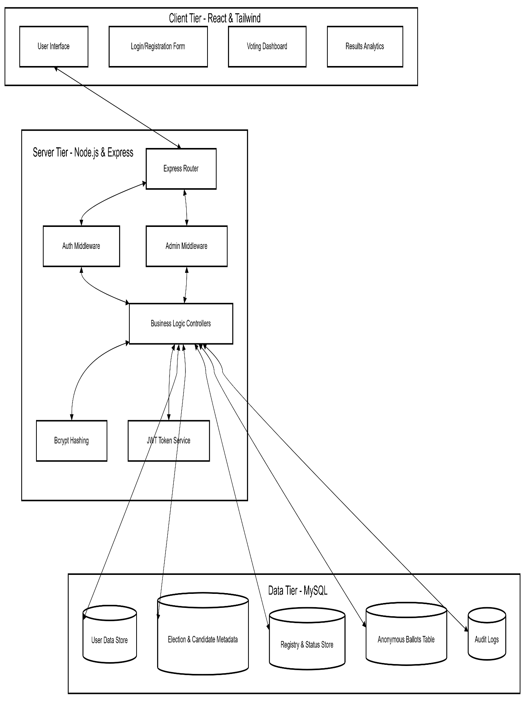

---

## Entity Relationship Diagram

  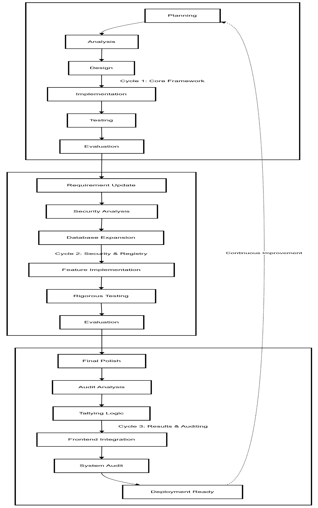

---

## System Diagram / Screenshot 6

  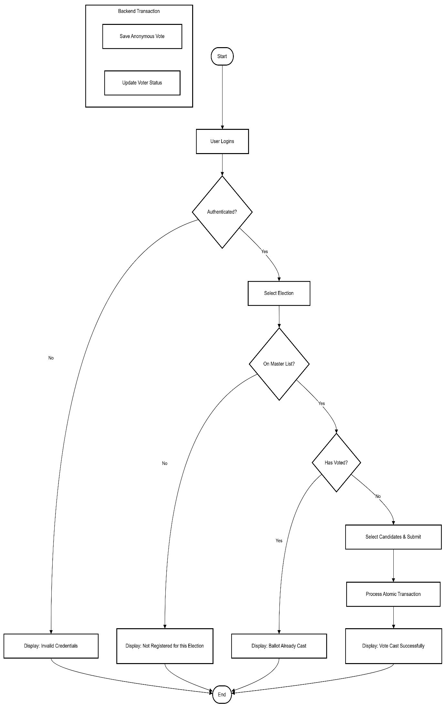

---

## System Diagram / Screenshot 7

  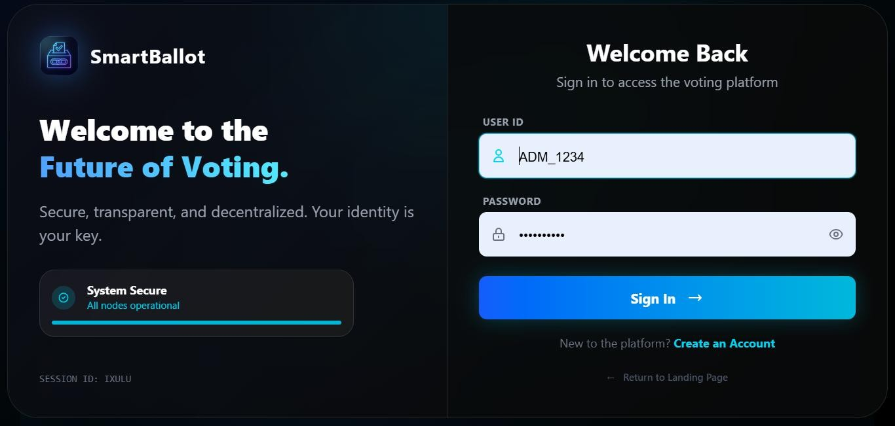

---

## System Diagram / Screenshot 8

  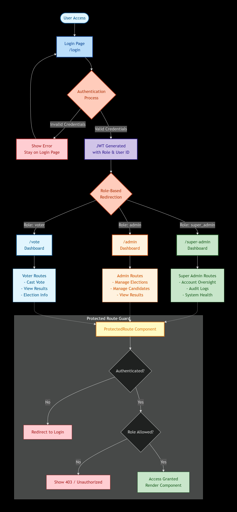

---

## System Diagram / Screenshot 9

  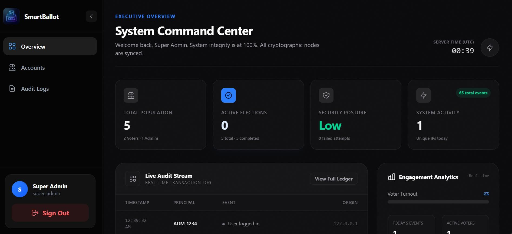

---

## System Diagram / Screenshot 10

  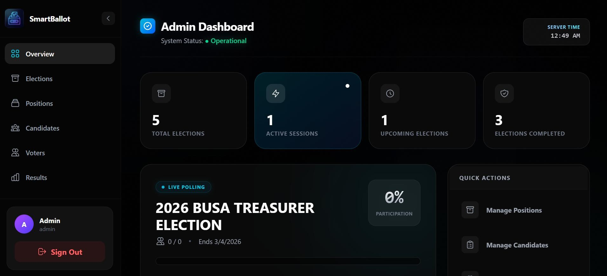

---

## System Diagram / Screenshot 11

  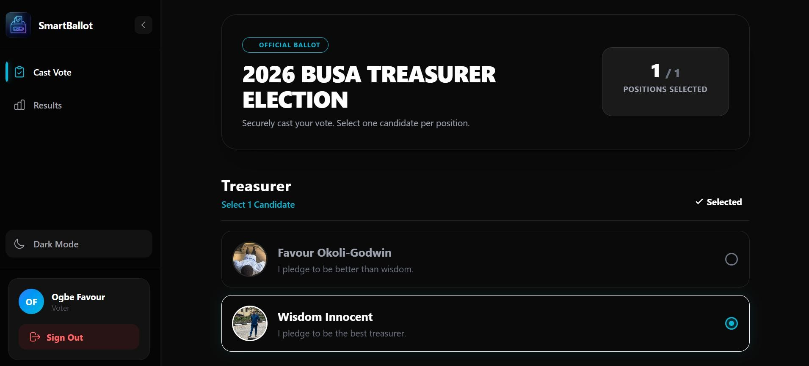

---

## System Diagram / Screenshot 12

  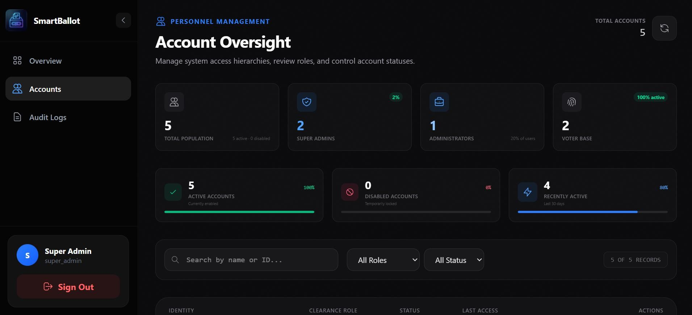

---

## System Diagram / Screenshot 13

  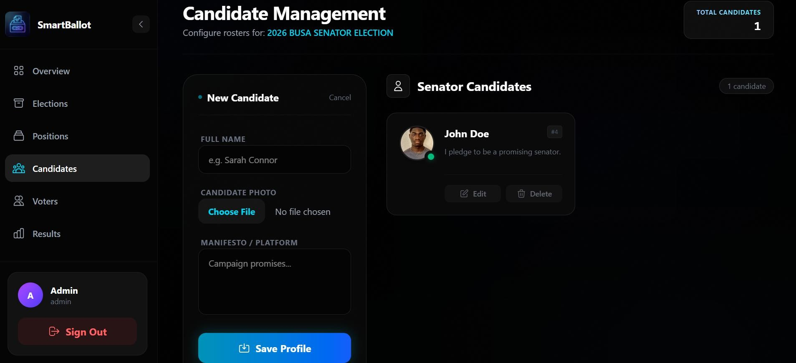

---

## Conclusion

- **Increased Accessibility:** Empowers more voters to participate remotely.

- **Advanced Security:** Safeguards votes through digital integrity mechanisms.

- **Future Additions:** Potential integrations with national ID systems, biometric login, and blockchain technology for immutable records.

---

# Thank You

 
**Questions?**
